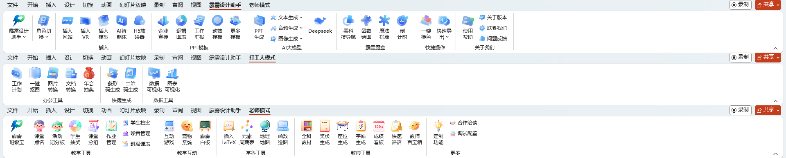
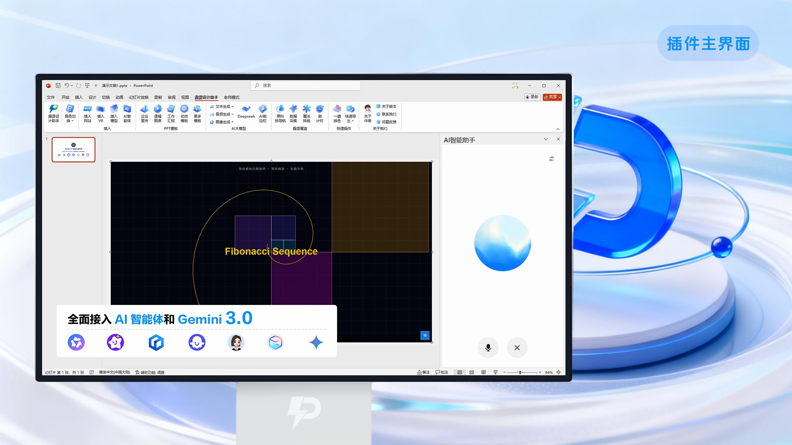
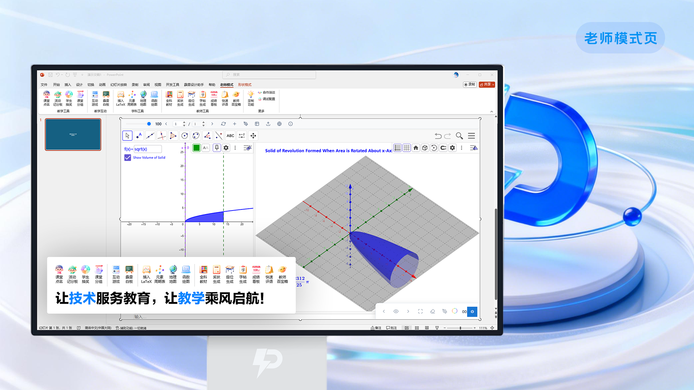
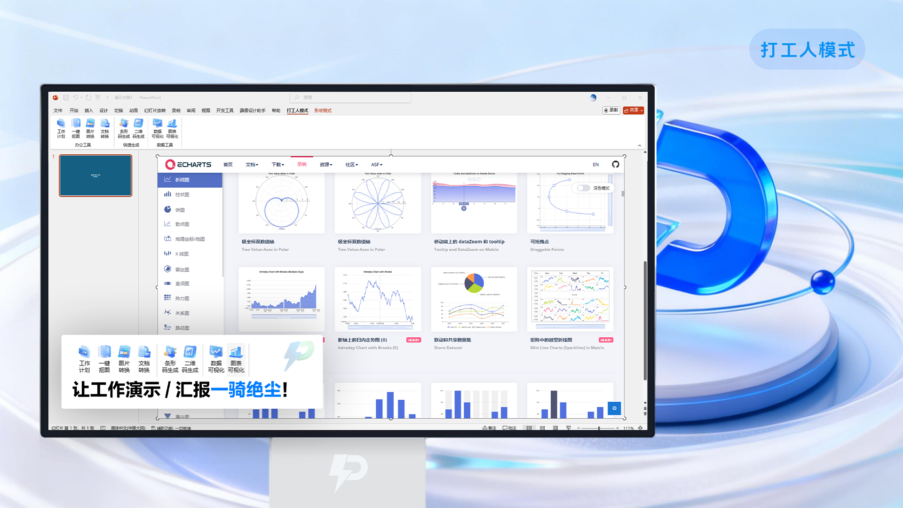

## 霹雳设计助手（pilidz-design）

### 项目简介

**霹雳设计助手 V2.5** 是一款面向办公与教学场景的 **PPT 插件**，支持 **Microsoft PowerPoint** 与 **WPS 演示**。  
支持在 PPT 中嵌入 **实时交互网页 + VR 场景 + 3D 模型**，并已接入多家国内外知名 **AI 模型**，可在 PPT 内生成演示文稿、Word 文档等。  
同时针对不同用户群体提供 **教师模式** 与 **打工人模式**：教师模式搭载 **霹雳班级宝**（系统性的班级管理 SaaS 系统），支持班级管理全流程数字化与智能化；打工人模式提供抽奖系统、文件转换、数据可视化等实用功能，更多能力也在持续开发中。  

本仓库仅提供安装包（如 `霹雳设计助手V2.5.exe` / `V2.6.exe` 等版本），**不公开源代码**。  
插件通过深度集成 Web 技术、VR/3D 内容与多家 AI 平台，帮助用户在 PPT 中构建更专业、更智能的演示体验。

---

---

### 下载

这儿是关于霹雳设计助手的全部下载链接，我们希望通过我们的努力让您的 PPT 独树一帜，一切不止于演示！

- **主程序下载**
  - 官网渠道：[`https://pilidz.cn/piliapp`](https://pilidz.cn/piliapp)

- **依赖库下载（仅部分旧系统需要手动安装）**
  - 霹雳设计助手（绝大部分插件）需要下面依赖库才能正常运行。  
    在 **Win11 等较新系统** 中通常已自带；部分 **Win7 / Win10** 可能缺少，需要自行下载安装后，才能正常运行 Office 插件：
  - **.NET Framework 4.7**：[`点击下载`](https://pan.quark.cn/s/61b638ef55a8)
  - **Edge WebView2 Runtime**：[`下载 64 位安装包`](https://msedge.sf.dl.delivery.mp.microsoft.com/filestreamingservice/files/ba1bb4b1-79ea-47b5-a0e0-967253cd7900/MicrosoftEdgeWebView2RuntimeInstallerX64.exe)
  - **VSTO 运行环境**：[`点击下载`](https://pan.quark.cn/s/f98e0688cfd8)
  - **VC++ 2010 运行库**：[`点击下载`](https://pan.quark.cn/s/a2fcb36c3bb7)

### 功能亮点一览（截至 V2.5）

- **常规模式**

  1. **实时交互网页 / 本地 HTML 嵌入**
     - **网页占位符**：在 PPT 中插入 `_webPage` 占位符，绑定在线 URL、本地 HTML 文件或直接粘贴 HTML 代码。
     - **播放时实时加载**：放映时自动在指定位置弹出 WebView2 窗口，展示可交互网页、在线图表、表单等。
     - **本地文件支持**：支持 `file:///` 本地 HTML、临时 HTML 文件（代码生成）、以及本地目录 HTTP 方式访问。

  2. **VR 场景与 3D 模型嵌入**
     - **VR 资源占位符**：通过 `_webPage` 占位符的 VR 标签嵌入本地全景图片或在线 VR 链接，放映时调用内置 VR 查看器。
     - **VR 资源管理**：集成 `VRResourcePane` 侧边栏，可一键复制图片到 VR 资源目录、生成访问地址。
     - **3D 模型占位符**：支持本地 / 在线 3D 模型（含模型查看器路径、模型路径、URL 等标签配置）。
     - **3D 模型查看**：放映时自动调用 3D Viewer（本地 `index.html`），在 PPT 中旋转、缩放模型。

  3. **多家国内外 AI 模型聚合**
     - 在插件内统一聚合 **Deepseek、ChatGPT、通义千问、讯飞星火、Gemini、Copilot、Midjourney、文心一格、豆包、Kimi、天工、Meta AI、Grok** 等 AI 平台。
     - 借助 AI 助手侧边栏，支持：
       - 生成 / 改写 PPT 文案与结构
       - 生成 Word 文档、总结报告、演讲稿
       - 进行翻译、润色、问答、图像创作等。
     - 提供专门的 **AI 智能体占位符** 功能，可为幻灯片注入 AI Agent 入口。

  4. **侧边栏工具体系（TaskPane）**
     - **网页插入侧边栏**：通过侧边栏管理网页占位符的 URL、本地文件、HTML 代码等。
     - **VR 资源侧边栏**：管理 VR 图片资源、快速绑定到占位符。
     - **3D 模型侧边栏**：管理 3D 模型资源，检测当前选中占位符并绑定模型与查看器。
     - **AI 智能体侧边栏**：为当前选中形状快速配置 AI Agent 链接。
     - **网址导航侧边栏**：内置常用站点导航页，便于一键打开常用网站。
     - **主题颜色 / 暗色模式侧边栏**：统一 PPT 主题颜色，并支持暗色模式；对新插入形状和文字自动调整样式。
     - **设计工具侧边栏**：提供排版与设计相关辅助工具，提高 PPT 设计效率。
     - **倒计时侧边栏**：配置并管理 PPT 放映过程中的倒计时展示。

  5. **文档与图片处理**
     - **导出 PDF**：支持对当前演示文稿导出高质量 PDF，提供对话框配置和简化导出备选方案。
     - **导出图片**：将幻灯片批量导出为图片，支持多种尺寸与比例。
     - **文档转换**：通过本地 Document Conversion 工具，实现 Word / PDF / 图片等文档互转。
     - **图片格式转换 / 在线抠图**：集成图片转换 H5 工具与在线抠图网站入口，方便快速处理素材。

  6. **二维码 / 条形码与可视化组件**
     - **条形码生成器**：本地 H5 条形码生成工具，支持快速生成条码并插入 PPT。
     - **二维码生成器**：支持生成各种内容的二维码（网址、文本等），用于海报、课件和活动物料。
     - **数据可视化组件**：集成本地数据可视化页面与 ECharts 官方示例入口，用于构建可视化图表。

  7. **模板、设计与在线资源入口**
     - **PPT 模板下载**：集成 `https://pilidz.cn` 系列模板站点，包括定制模板、动效模板、逻辑图表模板、企业宣传模板等。
     - **动画与动效模板**：专门的动效模板入口，帮助快速制作高质量动效演示。
     - **企业宣传 / 工作报告专用页面**：为职场用户提供针对性的模板与内容结构参考。
     - **图片 / 文档 / 在线工具入口**：集中入口跳转至常用外部工具网站（如在线抠图、第三方可视化工具等）。

- **老师模式**

  1. **教学互动 / 课堂工具（本地 H5 工具）**
     - **教师百宝箱**：内置「教师百宝箱」H5 工具集合，通过本地 `index.html` 打开。
     - **快速评语**：提供学生评语模板与快速生成工具。
     - **学生抽奖**：支持课堂抽学生、点名等随机选择场景。
     - **活动记分板 / 成绩看板**：可视化展示活动得分与班级成绩情况。
     - **课堂座位管理**：通过可视化座位表管理学生座位分布。
     - **字帖生成器**：为语文 / 书法 / 英语场景提供字帖生成工具。
     - **全科教材 / 学科资源**：通过本地教材资源入口快速调用教学素材。
     - **GeoGebra 数学工具、地理地图、元素周期表等**：集成多种理科教学辅助工具。
     - **课堂分组、白板、噪音管理、宠物系统等**：围绕课堂管理和课堂氛围设计的一组 H5 工具。

  2. **霹雳班级宝（教师模式专属班级管理系统）**
     - 以 **霹雳班级宝** 为核心，将班级管理全流程数字化，主要功能包括：
       - **班级看板**：一屏总览班级出勤、任务、积分、表现等关键数据。
       - **学生档案**：管理学生基础信息、画像与个性标签。
       - **快速分组**：按随机 / 条件等方式一键分组，用于课堂活动与合作任务。
       - **荣誉榜单**：展示优秀学生、优秀小组等荣誉信息。
       - **积分商城**：将课堂积分兑换为奖励，支持自定义奖品与规则。
       - **积分抽奖**：基于积分的抽奖活动，激励学生积极参与课堂。
       - **加分系统**：灵活配置加减分规则，记录每次加减分明细。
       - **班级课表**：管理与展示班级课程表，支持课堂中快速查看。
       - **课堂点到**：支持课堂签到、迟到、缺勤等出勤记录。
       - **作业管理**：布置、跟踪与统计作业完成情况。
       - **班费管理**：记录班费收入支出，用于透明化财务管理。
       - **番茄时间**：通过番茄钟帮助课堂或自习管理专注时间。
       - **噪音管理**：可视化噪音监控与提醒，维护良好课堂秩序。
       - **班委选举**：支持班委竞选、投票与结果展示。
       - **成绩看板**：图表化展示考试成绩、进步情况等。
       - **MBPI 测试**：用于性格 / 学习风格相关测试，辅助班级管理与分组。
       - **计时看板**：用于考试、课堂任务等场景的倒计时与时间提醒。
       - **班级树洞**：提供匿名交流空间，便于学生表达心声。
       - **课堂互动**：与课堂互动游戏联动，用于课堂问答、竞赛等。
       - **宠物系统**：通过班级宠物养成机制激励学生行为与积分积累。
       - **班级相册**：集中管理与展示班级活动照片与精彩瞬间。
       - **生日祝福**：记录与展示学生生日，为生日环节提供支持。
       - **值日管理**：安排与记录每日值日生任务。
       - **奖状生成**：一键生成各类电子奖状并应用于课堂展示。
       - **系统设置**：统一管理班级宝的基础配置与偏好。
     - 通过 **霹雳班级宝** 多页面系统在 PPT 内实现完整的班级运营闭环。

  3. **课堂相关侧边栏**
     - **课堂互动侧边栏**：用于课堂互动相关的操作入口。
     - **LaTeX 快粘助手侧边栏**：为数学公式用户提供 LaTeX 快速插入与管理功能。

- **打工人模式**

  1. **办公与活动增强**
     - **年会 / 活动抽奖系统**：使用专门的 H5 抽奖工具进行年会抽奖、团队活动抽奖。
     - **工作报告 / 企业宣传 / 逻辑图表模板入口**：一键打开对应网页，快速获取模板与灵感。
     - **数据可视化工具**：本地数据可视化 H5 工具，结合 ECharts 示例，实现图表快速预览与展示。
     - **AI PPT / 报告生成**：集成 NotebookLM 等 AI PPT 工具入口，辅助自动化生成演示文稿。

> **说明**：本 README 主要介绍截至 **霹雳设计助手 V2.5** 版本的核心功能亮点。后续版本（如 V2.6、V2.9）在此基础上会有功能扩展与优化。

---

### 适用环境

- **操作系统**
  - Windows 10 / Windows 11（推荐 64 位）
- **办公软件**
  - Microsoft Office PowerPoint（2016 / 2019 / 2021 / Office 365 等主流版本）
  - WPS Office 演示（部分功能依赖于 WebView2 及系统环境，具体以实际为准）
- **运行依赖**
  - 建议已安装 **Microsoft Edge WebView2 运行库**（大部分 Win10+ 系统已自带，如缺失安装程序会引导或提示）。

---

### 安装说明

1. 从本仓库的安装包目录中，下载对应版本的安装程序（如：`霹雳设计助手V2.5.exe` / `V2.6.exe` / `V2.9.exe`）。  
2. 右键 **以管理员身份运行** 安装程序。  
3. 按照安装向导完成安装，期间如有杀毒软件或安全提示，请选择信任或放行。  
4. 安装完成后，重启 PowerPoint / WPS，在功能区中找到 **“霹雳设计助手”** 选项卡。  
5. 首次使用时，可以根据需要选择：
   - **在线激活** / **本地激活**
   - 切换 **教师模式** 或 **打工人模式**。

---

### 使用模式简介

- **教师模式**
  - 面向 K12、高校、培训机构等教学场景。
  - 聚焦于：互动课堂、班级管理、教学资源调用与可视化展示。
  - 搭载 **霹雳班级宝系统**，提供“学生、作业、课堂、噪音、宠物”等多个子模块。

- **打工人模式**
  - 面向企业员工、职场用户、内容创作者。
  - 聚焦于：工作报告、项目汇报、年会活动、数据可视化、素材处理与转换等。

你可以在 角色切换 中通过角色切换按钮在 **教师模式 / 打工人模式** 之间自由切换，插件会自动显示对应模式下的功能区与工具集合。

---

### 版本与更新

- 插件内置 **自动更新检查逻辑**：
  - 启动后延迟检测更新，降低对启动速度的影响。
  - 支持“强制更新”状态，确保在重大版本或兼容性更新时用户及时升级。
- 也可以在插件功能区中手动点击 **“版本 / 更新检查”** 按钮发起更新检测。

本仓库中可能同时提供多个版本安装包（如 `V2.1 / V2.5 / V2.6 / V2.9` 等），你可以根据实际需要选择安装版本。

---

### 问题反馈与 Bug 提交

- 使用过程中如果遇到：
  - 安装失败 / 激活异常
  - PPT 中功能按钮无响应
  - 网页 / VR / 3D 内容无法正常加载
  - 教师模式 / 打工人模式某些功能异常
- 欢迎在本仓库的 **Issues** 中提交反馈，建议包含：
  - 操作系统版本（如 Win11 22H2）
  - Office / WPS 版本信息
  - 插件版本号（例如：`霹雳设计助手 V2.5`）
  - 复现步骤与截图 / 错误提示。

> **说明**：使用中如果遇到 Bug，可以在 **Issues** 中反馈，我们会在后续版本中持续修复与优化。更多功能也在持续开发中，欢迎持续关注。

---
